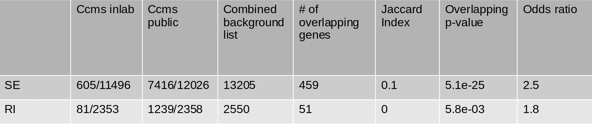
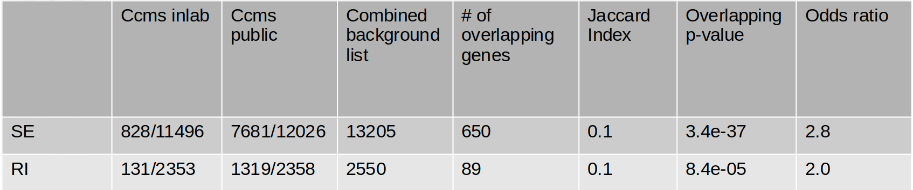

```{r setup, include=FALSE}
knitr::opts_chunk$set(message=FALSE,warning=FALSE, cache=TRUE)
```

```{r include=FALSE}
library(ggplot2)
library(RColorBrewer)
library(ggrepel)
library(plotly)
library(DESeq2)
library(data.table)
library(dplyr)
library(tidyverse)
library(DESeq2)
library(heatmaply)
library(GeneOverlap)
### function for getting genes with common splicing events ###
get_full_overlap_output <- function(x,y,z){
  #get differentially spliced lists
  spl1 <- read.table(x,sep = '\t', header = TRUE, stringsAsFactors = FALSE) %>%
    dplyr::filter(FDR < z) %>%
    dplyr::distinct(GeneID,.keep_all=TRUE)
  spl1$GeneID <- gsub("[.][0-9]*", "", spl1$GeneID)
  spl2 <- read.table(y,sep = '\t', header = TRUE, stringsAsFactors = FALSE) %>%
    dplyr::filter(FDR < z) %>%
    dplyr::distinct(GeneID,.keep_all=TRUE)
  spl2$GeneID <- gsub("[.][0-9]*", "", spl2$GeneID)
  #get background lists
  bg1 <- read.table(x,sep = '\t', header = TRUE, stringsAsFactors = FALSE)%>%
    dplyr::distinct(GeneID,.keep_all=TRUE)
  bg1$GeneID <- gsub("[.][0-9]*", "", bg1$GeneID)
  print(length(bg1$GeneID))
  bg2 <- read.table(y,sep = '\t', header = TRUE, stringsAsFactors = FALSE)%>%
    dplyr::distinct(GeneID,.keep_all=TRUE)
  bg2$GeneID <- gsub("[.][0-9]*", "", bg2$GeneID)
  print(length(bg2$GeneID))
  #combined background lists
  comb_bg_list <- bind_rows(bg1,bg2) %>% 
    distinct(GeneID) %>%
    filter(GeneID != "nan")
  write_tsv(comb_bg_list, file = "~/Documents/combined_bg_list.txt",col_names = FALSE)
  #overlap analysis
  go.obj <- newGeneOverlap(spl1$GeneID,spl2$GeneID,genome.size=length(comb_bg_list$GeneID),spec="mm9.gene")%>%
      testGeneOverlap()
  print(go.obj)
  intersect_df <- as.data.frame(go.obj@intersection)
  colnames(intersect_df)="GeneID"
  write_tsv(intersect_df,file="~/Documents/intersect_list.txt",col_names=FALSE)
  #check junction counts
  spl1 <- semi_join(spl1,intersect_df,by="GeneID")
  spl2 <- semi_join(spl2,intersect_df,by="GeneID")
  return(list(intersect_df,spl1,spl2))
}
### ccms SE dataset ###
#se_ccms_all <- get_full_overlap_output("SE.MATS.JC_inlab_ccms.txt","SE.MATS.JC_public_ccms.txt",0.1)
### ccms RI dataset ###
#ri_ccms_all <- get_full_overlap_output("RI.MATS.JC_inlab_ccms.txt","RI.MATS.JC_public_ccms.txt",0.1)
###SE sf3b4 vs sf3b1###
#se_all_sf3 <- get_full_overlap_output("SE.MATS.JCsf3b4.txt","SE.MATS.JC_sf3b1.txt",0.1)
### RI sf3b4 vs sf3b1###
#RI_all_sf3 <- get_full_overlap_output("RI.MATS.JCsf3b4.txt","RI.MATS.JC_sf3b1.txt",0.1)
```
# Stats FDR < 0.05
<table>
  <tr>
    <td></td>
  </tr>
 </table>

# SE DAVID Pathway Analysis 
Top 20 terms with highest FDR
```{r echo=FALSE}
### DOT PLOT FOR PATHWAY ANALYSIS ###
read.table("DAVID_se_ccms.txt",sep = '\t', header = TRUE, stringsAsFactors = FALSE) %>% dplyr::select(c("Term", "Count", "FDR")) %>%
  mutate(Term = gsub("^(.*)~", "", Term)) %>%
  group_by(FDR) %>% slice_head(n=5) %>% ggplot(aes(x = FDR, y = factor(Term, levels = Term), size = Count)) + 
  geom_point() +
  labs(y = "Gene Ontology/KEGG Pathway", title="") +
  geom_text(aes(x = FDR*0.9, y = Term, label = Count), size = 3, check_overlap = TRUE, nudge_x = 0.05,nudge_y = 0.4) +
  geom_vline(xintercept = 0.05, colour = "red", linetype = "dashed") +
  coord_cartesian(clip = "off")+
  annotate("text", x = 0.05, y = 0, label = "FDR = 0.05", color = "red") +
  theme(plot.title=element_text(face="bold",size=12), axis.title.y = element_text(size=10,face="bold"),axis.text.y = element_text(face = "bold",size = 8,colour = "blue"))
```

# RI DAVID Pathway Analysis
```{r echo=FALSE}
### DOT PLOT FOR PATHWAY ANALYSIS ###
read.table("DAVID_RI_ccms.txt",sep = '\t', header = TRUE, stringsAsFactors = FALSE) %>% dplyr::select(c("Term", "Count", "FDR")) %>%
  mutate(Term = gsub("^(.*)~", "", Term)) %>%
  arrange(desc(Count)) %>% ggplot(aes(x = FDR, y = factor(Term, levels = Term), size = Count)) + 
  geom_point() +
  labs(y = "Gene Ontology/KEGG Pathway", title="") +
  geom_text(aes(x = FDR*0.9, y = Term, label = Count), size = 3, check_overlap = TRUE, nudge_x = 0.05,nudge_y = 0.4) +
  geom_vline(xintercept = 0.05, colour = "red", linetype = "dashed") +
  coord_cartesian(clip = "off")+
  annotate("text", x = 0.05, y = 0, label = "FDR = 0.05", color = "red") +
  theme(plot.title=element_text(face="bold",size=12), axis.title.y = element_text(size=10,face="bold"),axis.text.y = element_text(face = "bold",size = 8,colour = "blue"))
```

# Stats FDR < 0.1
<table>
  <tr>
    <td></td>
  </tr>
 </table>
 
# SE DAVID Pathway Analysis
Top 20 terms with highest FDR
```{r echo=FALSE}
### DOT PLOT FOR PATHWAY ANALYSIS ###
read.table("fdr01_DAVID_SE_CCMS.txt",sep = '\t', header = TRUE, stringsAsFactors = FALSE) %>% dplyr::select(c("Term", "Count", "FDR")) %>%
  mutate(Term = gsub("^(.*)~", "", Term)) %>%
  group_by(FDR) %>% slice_head(n=5) %>% ggplot(aes(x = FDR, y = factor(Term, levels = Term), size = Count)) + 
  geom_point() +
  labs(y = "Gene Ontology/KEGG Pathway", title="") +
  geom_text(aes(x = FDR*0.9, y = Term, label = Count), size = 3, check_overlap = TRUE, nudge_x = 0.07,nudge_y = 0.5) +
  geom_vline(xintercept = 0.05, colour = "red", linetype = "dashed") +
  coord_cartesian(clip = "off")+
  annotate("text", x = 0.05, y = 0, label = "FDR = 0.05", color = "red") +
  theme(plot.title=element_text(face="bold",size=12), axis.title.y = element_text(size=10,face="bold"),axis.text.y = element_text(face = "bold",size = 8,colour = "blue"))
```

# RI DAVID Pathway Analysis
```{r echo=FALSE}
### DOT PLOT FOR PATHWAY ANALYSIS ###
read.table("fdr01_DAVID_RI_ccms.txt",sep = '\t', header = TRUE, stringsAsFactors = FALSE) %>% dplyr::select(c("Term", "Count", "FDR")) %>%
  mutate(Term = gsub("^(.*)~", "", Term)) %>%
  arrange(desc(Count)) %>% ggplot(aes(x = FDR, y = factor(Term, levels = Term), size = Count)) + 
  geom_point() +
  labs(y = "Gene Ontology/KEGG Pathway", title="") +
  geom_text(aes(x = FDR*0.9, y = Term, label = Count), size = 3, check_overlap = TRUE, nudge_x = 0.05,nudge_y = 0.4) +
  geom_vline(xintercept = 0.05, colour = "red", linetype = "dashed") +
  coord_cartesian(clip = "off")+
  annotate("text", x = 0.05, y = 0, label = "FDR = 0.05", color = "red") +
  theme(plot.title=element_text(face="bold",size=12), axis.title.y = element_text(size=10,face="bold"),axis.text.y = element_text(face = "bold",size = 8,colour = "blue"))
```