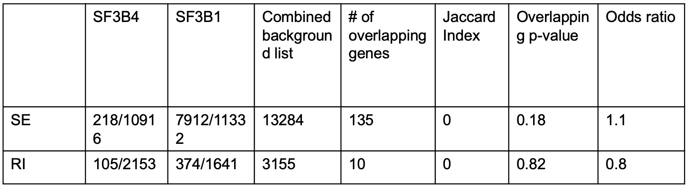
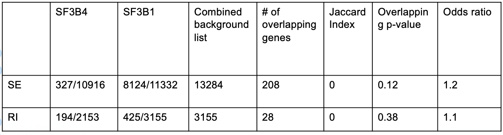
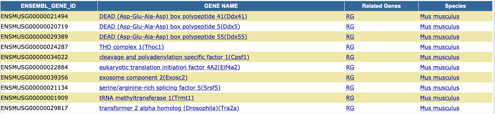

```{r setup, include=FALSE}
knitr::opts_chunk$set(message=FALSE,warning=FALSE, cache=TRUE)
library(tiff)
library(grid)
setwd("~/Documents/GIT_loydie_splicing_project/docs")
```

*mouse orthologs were obtained for human SF3B1 genes*

# Stats FDR < 0.05
<table>
  <tr>
    <td></td>
  </tr>
 </table>

# SE DAVID Pathway Analysis 
```{r echo=FALSE}
grid::grid.raster( tiff::readTIFF( "DAVID_sf3_dotplot_fdr05.tiff") )
```

# RI DAVID Pathway Analysis
```{r echo=FALSE}
grid::grid.raster( tiff::readTIFF( "DAVID_sf3_dotplot_RI_05.tiff") )
```

# Stats FDR < 0.1
<table>
  <tr>
    <td></td>
  </tr>
 </table>
 
# SE DAVID Pathway Analysis
```{r echo=FALSE}
grid::grid.raster( tiff::readTIFF( "DAVID_sf3_dotplot_SE_01.tiff") )
```

# RI DAVID Pathway Analysis
```{r echo=FALSE}
grid::grid.raster( tiff::readTIFF( "DAVID_sf3_dotplot_RI_01.tiff") )
```
 
# 'Nucleotide Binding' genes for RI FDR < 0.1
 <table>
  <tr>
    <td></td>
  </tr>
 </table>